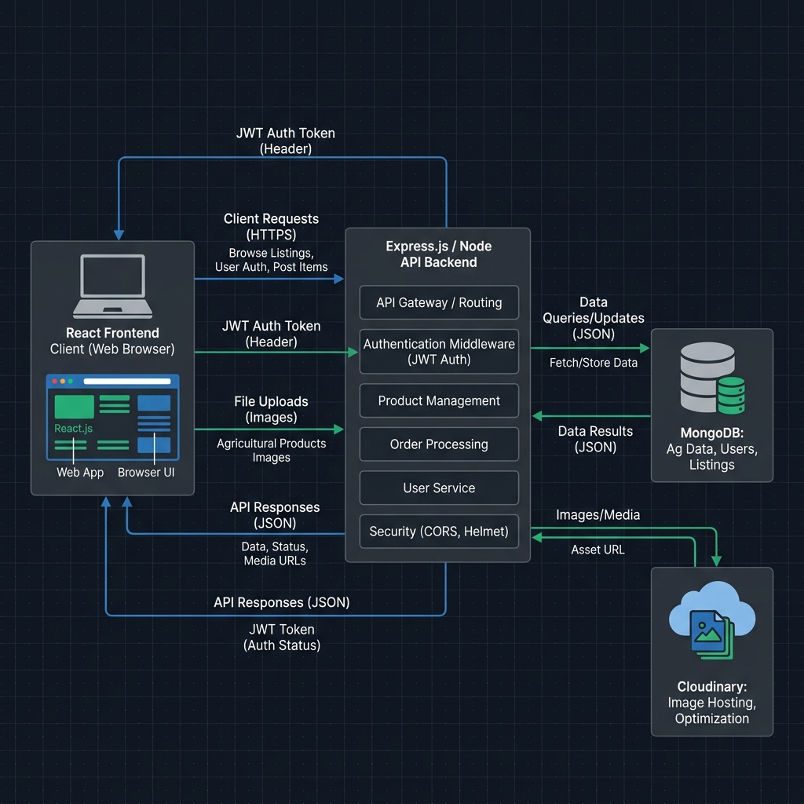

# Veritas — MERN Agricultural Marketplace with QR Traceability

Veritas is a backend-focused MERN stack agricultural marketplace that enables verified farmers to sell crop yields directly to buyers, backed by QR-based product traceability and verification.

Designed to showcase clean database modeling, well-structured Express API routing, role-based access control (RBAC), and transaction safety in a single, consolidated MERN codebase.

---

## 📐 System Architecture

Here is the architectural design showing the integration of the React frontend, modular Express REST API, MongoDB storage, and Cloudinary media pipeline:



---

## 📸 Application Screenshots

Below are live views of the application dashboards, landing page, and verification tracking workflows:

| Marketplace Landing Page | Public Traceability Timeline |
| :---: | :---: |
|  |  |
| **Farmer Crop Creation Dashboard** | **Admin Control Panel** |
|  |  |

---


## 🚀 Key Engineering & Implementation Highlights

### 1. Modular Express Backend
The backend utilizes a clean, modular structure. Instead of an overengineered microservice monorepo, the application is consolidated into a single codebase structured domain-by-domain under `server/modules/`:
*   `auth/` - Token-based registration, login, and sessions
*   `users/` - User profiles and farmer verification
*   `products/` - Crop catalog CRUD, filtering, and stock levels
*   `certifications/` - Agricultural certification uploads (Organic, GMO-Free)
*   `orders/` - Checkout and inventory deduction
*   `traceability/` - Product lifecycle timeline and scan history logging
*   `admin/` - Platform verification approvals and listings visibility toggle

### 2. Preventing Stock Inconsistencies during Simultaneous Orders
To prevent stock levels from going out of sync (overselling or double-allocation) during checkout, the checkout endpoint implements atomic updates:
*   **Atomic Query Filtering**: Employs `findOneAndUpdate` with a condition `{ stockQuantity: { $gte: item.quantity } }` and modification `{ $inc: { stockQuantity: -item.quantity } }`. This executes as a single atomic write operation in MongoDB.
*   **Mongoose Multi-Document Transactions**: Automatically wraps checkout steps in a transaction session (`startSession`, `startTransaction`) when connected to a replica set/sharded environment, rolling back inventory deductions if any order step fails.

### 3. QR-Based Product Traceability and Verification
*   **Traceability Timeline**: Enables farmers to register chronological crop events (`seed` -> `planting` -> `growing` -> `harvest` -> `processing` -> `packaging` -> `shipping` -> `retail`).
*   **QR Landing Endpoint**: Exposes a public endpoint `/trace/:productId` that fetches the entire product history, including farmer details, organic credentials, and timeline.
*   **Scan History Logging**: Every scan of the QR code logs metadata asynchronously (`ScanHistory`) including the visitor's User-Agent, IP address, and approximate location details (retrieved via browser Geolocation consent).

### 4. Farmer Verification Workflow
*   Farmers register with an initial verification status of `none`.
*   Farmers upload a verification document (licensing, land deed, or ID) via a Multer-Cloudinary pipeline.
*   The upload updates their status to `pending`, notifying the platform administrator.
*   Upon Admin approval, the status changes to `verified`, allowing the farmer to publish active listings to the marketplace.

---

## 🛠️ Technology Stack

*   **Frontend**: React (Vite), React Router DOM, Axios, TailwindCSS, Lucide-React
*   **Backend**: Node.js, Express.js, Multer, Mongoose (MongoDB ORM)
*   **Cloud Integrations**: Cloudinary (file storage)
*   **Tooling**: Concurrently (multi-process execution), Nodemon (dev reload)

---

## 📁 Repository Structure

```
veritas/
├── client/                     # React Frontend Application
│   ├── src/
│   │   ├── components/         # Common widgets (Header, Footer)
│   │   ├── context/            # AuthContext (JWT session state)
│   │   └── pages/              # Dashboard Pages (Farmer, Buyer, Admin, Trace)
│   ├── package.json
│   └── index.html
├── server/                     # Express.js REST API Backend
│   ├── config/                 # Database and Cloudinary settings
│   ├── middleware/             # Auth/Role gates and error handlers
│   ├── modules/                # Domain modules (controllers, models, routes)
│   ├── utils/                  # QR Code utility
│   ├── package.json
│   └── index.js
├── README.md                   # System documentation
├── package.json                # Dev scripts and dependencies
└── .env.example                # Sample environment configuration
```

---

## ⚙️ Local Development Setup

### Prerequisites
*   Node.js (v18+)
*   MongoDB (running locally on port 27017 or a MongoDB Atlas URI)

### 1. Install Dependencies
Install all root, server, and client dependencies with a single command:
```bash
npm run install:all
```

### 2. Configure Environment Variables
Create a `.env` file inside the `server/` directory:
```bash
# server/.env
PORT=5000
MONGODB_URI=mongodb://localhost:27017/veritas
JWT_SECRET=veritas_secret_key_for_jwt_session_signing_123
CLOUDINARY_CLOUD_NAME=your_cloudinary_cloud_name
CLOUDINARY_API_KEY=your_cloudinary_api_key
CLOUDINARY_API_SECRET=your_cloudinary_api_secret
```

### 3. Run the Application
Start both the Express API server and the Vite React development server concurrently:
```bash
npm run dev
```
*   **Frontend**: http://localhost:5173
*   **Backend API**: http://localhost:5000
*   **API Health**: http://localhost:5000/health
